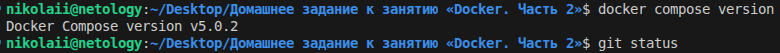
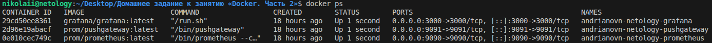
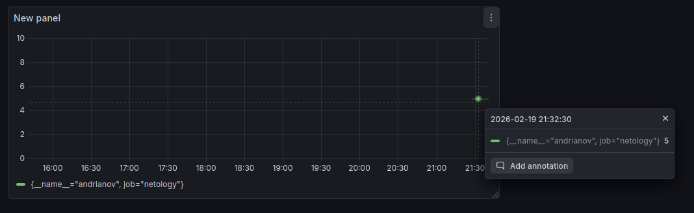
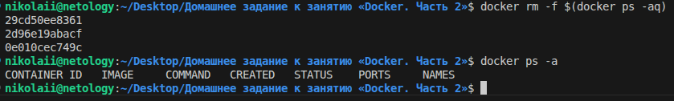

# Домашнее задание к занятию "`Docker. Часть 2`" - `Николай Андрианов`

---

### Задание 1

`Приведите ответ в свободной форме`

`Установите Docker Compose и опишите, для чего он нужен и как может улучшить лично вашу жизнь.`

Как правило плагин docker-compose ставится сразу с Docker 

**Docker Compose** — это инструмент, который позволяет описывать и запускать многоконтейнерные приложения одной командой. Вместо того чтобы вручную запускать каждый контейнер с длинными параметрами, мы создаём файл `docker-compose.yml`, где указываются все сервисы, их настройки, сетевые соединения и зависимости. Затем одной командой `docker-compose up` поднимается вся инфраструктура сразу.

### Как это улучшит лично мою жизнь

Я перестану тратить время на запоминание и вбивание десятков команд для запуска окружения. Если проект сложный (например, веб-приложение + база данных + кеш + веб-сервер), достаточно будет один раз описать его в Compose-файле, положить в репозиторий, и любой коллега или я сам на новом компьютере смогу запустить проект одной командой. Это исключит ситуации *«а у меня работает»*, упростит тестирование и избавит от рутины при развёртывании.

---

### Задание 2

`Выполните действия и приложите текст конфига на этом этапе.`

Создайте файл docker-compose.yml и внесите туда первичные настройки:

- version;
- services;
- volumes;
- networks.

При выполнении задания используйте подсеть 10.5.0.0/16. Ваша подсеть должна называться: <ваши фамилия и инициалы>-my-netology-hw. Все приложения из последующих заданий должны находиться в этой конфигурации. 

---

### Задание 3

`Выполните действия:`

1. `Создайте конфигурацию docker-compose для Prometheus с именем контейнера <ваши фамилия и инициалы>-netology-prometheus.`
2. `Добавьте необходимые тома с данными и конфигурацией (конфигурация лежит в репозитории в директории 6-04/prometheus ).`
3. `ЗОбеспечьте внешний доступ к порту 9090 c докер-сервера.`

---

### Задание 4

`Выполните действия:`

1. `Создайте конфигурацию docker-compose для Pushgateway с именем контейнера <ваши фамилия и инициалы>-netology-pushgateway.`
2. `Обеспечьте внешний доступ к порту 9091 c докер-сервера.`

---

### Задание 5

`Выполните действия:`

1. `Создайте конфигурацию docker-compose для Grafana с именем контейнера <ваши фамилия и инициалы>-netology-grafana.`
2. `Добавьте необходимые тома с данными и конфигурацией (конфигурация лежит в репозитории в директории 6-04/grafana.`
3. `Добавьте переменную окружения с путем до файла с кастомными настройками (должен быть в томе), в самом файле пропишите логин=<ваши фамилия и инициалы> пароль=netology.`
4. `Обеспечьте внешний доступ к порту 3000 c порта 80 докер-сервера.`

---

### Задание 6

`Выполните действия:`

1. `Настройте поочередность запуска контейнеров.`
2. `Настройте режимы перезапуска для контейнеров.`
3. `Настройте использование контейнерами одной сети.`
4. `Запустите сценарий в detached режиме.`

---

### Задание 7

`Выполните действия:`

1. `Выполните запрос в Pushgateway для помещения метрики <ваши фамилия и инициалы> со значением 5 в Prometheus: echo "<ваши фамилия и инициалы> 5" | curl --data-binary @- http://localhost:9091/metrics/job/netology.`
2. `Залогиньтесь в Grafana с помощью логина и пароля из предыдущего задания.`
3. `Cоздайте Data Source Prometheus (Home -> Connections -> Data sources -> Add data source -> Prometheus -> указать "Prometheus server URL = http://prometheus:9090" -> Save & Test).`
4. `ЗСоздайте график на основе добавленной в пункте 5 метрики (Build a dashboard -> Add visualization -> Prometheus -> Select metric -> Metric explorer -> <ваши фамилия и инициалы -> Apply.`

`Выполните действия:`
- docker-compose.yml целиком;
- скриншот команды docker ps после запуске docker-compose.yml;
- скриншот графика, постоенного на основе вашей метрики.

- `скриншот команды docker ps`

- `скриншот графика`

---

### Задание 8

`Выполните действия:`

1. `Остановите и удалите все контейнеры одной командой.`

сdocker rm -f $(docker ps -aq)

---